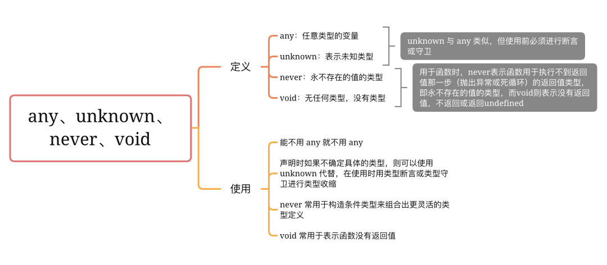

# TS 基础理论及原理

TypeScript 是 JavaScript 的一个超集，支持 ECMAScript 6 标准

## 基础类型
- 布尔值 
- 数字 
- 字符串 
- 数组 元素只能为数字, 注意和元组的区别
- 元组 相当于Js数组, 元素可以为任何类型
- 枚举




### unknown 和 any

- 两个都是TS的顶级类型
- any类型将 `跳过类型检查`
- unknown类型是any类型的安全版本。每当你想用any时，试着先用unknown
- `任何类型的数据` 都可以赋给 `unknown` 类型
```ts
let value: unknown;

value = true; // OK
value = 42; // OK
value = "Hello World"; // OK
value = []; // OK
value = {}; // OK
value = Math.random; // OK
value = null; // OK
value = undefined; // OK
value = new TypeError(); // OK
value = Symbol("type"); // OK
```


- `unkown` 类型的值 `只能` 赋给 `any 或 unkown` 本身

```ts
let value: unknown;

let value1: unknown = value; // OK
let value2: any = value; // OK
let value3: boolean = value; // Error
let value4: number = value; // Error
let value5: string = value; // Error
let value6: object = value; // Error
let value7: any[] = value; // Error
let value8: Function = value; // Error
```


- 这些any的操作都不再被允许
```ts
let value: unknown;

value.foo.bar; // Error
value.trim(); // Error
value(); // Error
new value(); // Error
value[0][1]; // Error
```


